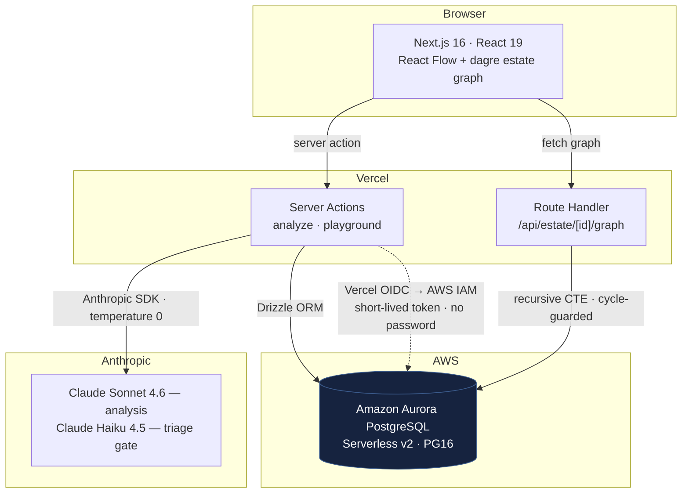

# COBOL Estate Modernizer

> Point it at a pile of legacy mainframe code and it hands you back a map:
> which programs call which, where the business rules are buried, and which call
> chains quietly loop back on themselves. The kind of thing a modernization team
> normally spends months reconstructing by hand — before they dare touch a line.

Built for the **H0 Hackathon — Track 2 (Monetizable B2B)**, on the Vercel + AWS
Databases stack.

<!-- TODO: hero GIF — estate graph → click a node → business rules drill-down -->

---

## The problem

Banks, insurers, and governments run on billions of lines of COBOL that almost
nobody on staff fully understands anymore. The danger was never a single
program — it's the *graph*. What calls this thing? What does it call? And if I
rewrite it, what silently breaks three hops away?

Teams answer those questions manually, program by program, for months, before
any modernization can safely begin. This tool collapses that discovery phase
into something you can click through in an afternoon.

## What it actually does

You give it an estate. It gives you:

- **A live dependency graph** — programs and copybooks as nodes, typed CALL and
  COPY edges between them. Nodes scale with coupling, so the load-bearing
  programs jump out immediately.
- **Cycle-safe call-chain traversal** — the part worth reading the code for.
  COBOL call graphs can be mutually recursive (A calls B, B calls A). A naive
  walk never terminates. This one walks the *entire* downstream chain in a
  single database round-trip and turns any cycle it finds into a flagged
  re-platforming risk instead of an infinite loop.
- **AI analysis per program** — Explain, Modernize, Assess, and Extract modes,
  streamed live, with every run recorded back to the database as lineage you can
  trace later.

## How it's wired



It's one Next.js app — no separate Python service. Long analysis calls stream so
they stay inside serverless timeouts. The database hop authenticates through
Vercel's OIDC federation into an AWS IAM role: no password is stored anywhere, no
`DATABASE_URL` lives in the repo, and a short-lived token is minted per
connection at runtime.

## The one query worth reading

The headline feature is a single recursive CTE that carries an explicit
`path uuid[]` accumulator and an `is_cycle` flag. The moment a node reappears in
its own path it's flagged, the recursive arm stops expanding that branch
(`WHERE NOT c.is_cycle`), and a `maxDepth` bound backs it up. So a mutually
recursive COBOL call chain becomes a *visible product feature* — a risk ticket —
rather than a hang. There's an automated test that seeds an A↔B cycle and asserts
a finite, cycle-flagged result; if the guard ever regresses, the test hangs until
timeout, which is exactly the loud failure you want.

See [`lib/db/lineage.ts`](lib/db/lineage.ts) and
[ADR 0005](docs/adr/0005-recursive-cte-cycle-guard.md).

## Why these choices

The non-obvious decisions are written down as ADRs in [`docs/adr/`](docs/adr):

- [0002](docs/adr/0002-aurora-postgres-as-primary-datastore.md) — why Aurora PostgreSQL over DynamoDB and Aurora DSQL
- [0003](docs/adr/0003-polymorphic-typed-edges.md) — polymorphic typed edges, and the integrity tradeoff that comes with them
- [0004](docs/adr/0004-pg16-portability.md) — keeping the schema to core PG16 so persistence stays a swappable concern
- [0005](docs/adr/0005-recursive-cte-cycle-guard.md) — the cycle-safe traversal, proven by test

One design rule runs through all of it: **the model is never the source of
truth.** Claude returns structured `details`; the human-readable summary is
*derived in code* and reconciled back into those details. The LLM generates, the
application stays authoritative.

## Data model

`estate` → `program` / `copybook` / `analysis_run` / `ticket`; `data_element`
(a self-referential hierarchy); `business_rule` (traced back to the run that
produced it); `dependency` (the typed-edge graph itself). Full DDL lives in
[`lib/db/schema.sql`](lib/db/schema.sql), the Drizzle schema in
[`lib/db/schema.ts`](lib/db/schema.ts).

## Running it locally

```bash
pnpm install

# 1. Provision Aurora PostgreSQL Serverless v2 (PG16), then:
cp .env.example .env.local        # fill in DATABASE_URL + ANTHROPIC_API_KEY

# 2. TLS: fetch the AWS RDS CA bundle (verified, not disabled)
curl -o certs/rds-global-bundle.pem \
  https://truststore.pki.rds.amazonaws.com/global/global-bundle.pem

# 3. Apply the schema (source of truth, incl. partial index + deferred FK)
psql "$DATABASE_URL" -f lib/db/schema.sql

# 4. Seed a demo estate
pnpm tsx scripts/seed.ts

# 5. Run
pnpm dev
```

## Tests

```bash
pnpm test     # spins up a real Postgres 16 (testcontainers), applies schema.sql,
              # and proves the recursive call-chain terminates on cyclic input
```

Requires Docker.

## Stack

Next.js 16 (App Router, Turbopack) · React 19 · Vercel · Amazon Aurora
PostgreSQL Serverless v2 · Drizzle ORM · Anthropic TypeScript SDK · React Flow
(`@xyflow/react` + `@dagrejs/dagre`) · Vitest + Testcontainers

## Credits

Grew out of [cobol-ai-advisor](https://github.com/Nafsgerman/cobol-ai-advisor)
(the original Explain / Modernize / Assess / Extract prompts), re-architected for
the H0 stack with the persistence and lineage layer added during the hackathon.
