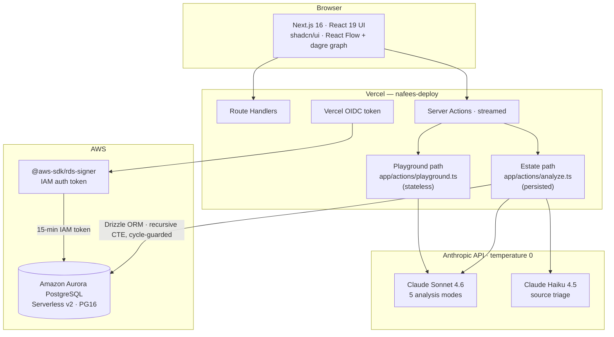

# COBOL Estate Modernizer

> A legacy-modernization knowledge base for enterprise COBOL estates. Analyzes
> mainframe programs with Claude to extract business rules and data lineage, then
> stores them as a queryable estate graph on Amazon Aurora PostgreSQL — so teams
> can *see* how programs, copybooks, and rules connect before they re-platform.

**H0 Hackathon — Track 2 (Monetizable B2B).** Built on the v0 / Vercel + AWS
Databases stack.

---

## Why this exists
Enterprises run billions of lines of COBOL no one fully understands anymore.
Before any modernization, someone has to answer: *what does this program do, what
calls it, and what business rules are buried inside it?* This tool turns
single-file analysis into an estate-wide, queryable graph that answers those
questions.

## What it does
- **Five analysis modes** — Explain, Modernize, Assess, Extract (ported from the
  original [cobol-ai-advisor](https://github.com/Nafsgerman/cobol-ai-advisor)),
  plus a graph-aware **Dependencies** mode. Each is a Claude call.
- **Estate graph** — programs, copybooks, data elements, and typed dependency
  edges, persisted in Aurora PostgreSQL.
- **Recursive call-chain traversal** — one SQL query walks the full call graph
  with cycle protection; mutually-recursive COBOL CALLs are detected and surfaced
  as re-platforming risks, not silently looped.
- **Interactive lineage** — a React Flow dependency graph; click a node to see
  the business rules extracted from it.

## How analysis stays trustworthy
This is not "ask the model and print the answer."
- Every analytical call runs at **`temperature: 0`** for determinism.
- In JSON modes the model returns only `details`; the `summary` is **derived in
  code** (`lib/ai/summarize.ts`) and rollups are reconciled back into `details`.
  The model's own summary is never trusted.
- **Estate** (DB-backed, persisted) and **playground** (stateless) are separate
  code paths, so the queryable graph is never polluted by throwaway runs.

## Architecture
Front-end on Vercel, two server-side analysis paths, Claude for reasoning, and
Aurora PostgreSQL as the system of record — reached over an IAM-signed
connection (no static DB password). Full diagram in
[`docs/architecture.mermaid`](docs/architecture.mermaid).



The engine is full Next.js — no separate Python service. Long analysis calls are
streamed to stay within serverless timeouts.

## Engineering decisions
Non-obvious choices are recorded as ADRs in [`docs/adr/`](docs/adr):
- [0002](docs/adr/0002-aurora-postgres-as-primary-datastore.md) — why Aurora PostgreSQL over DynamoDB / Aurora DSQL
- [0003](docs/adr/0003-polymorphic-typed-edges.md) — polymorphic typed edges, and the integrity tradeoff
- [0004](docs/adr/0004-pg16-portability.md) — PG16 portability (Aurora primary; one-line swap to Databricks Lakebase)
- [0005](docs/adr/0005-recursive-cte-cycle-guard.md) — cycle-safe recursive traversal, proven by test

## Data model
`estate` → `program` / `copybook` / `analysis_run` / `ticket`; `data_element`
(self-referential hierarchy); `business_rule` (traced back to the run that
produced it); `dependency` (the typed-edge graph). Full DDL in
[`lib/db/schema.sql`](lib/db/schema.sql), Drizzle schema in
[`lib/db/schema.ts`](lib/db/schema.ts).

## Local development
```bash
pnpm install

# 1. Provision Aurora PostgreSQL Serverless v2 (PG16), then:
cp .env.example .env.local        # fill in DATABASE_URL + ANTHROPIC_API_KEY

# 2. TLS: fetch the AWS RDS CA bundle (verified, not disabled)
curl -o certs/rds-global-bundle.pem \
  https://truststore.pki.rds.amazonaws.com/global/global-bundle.pem

# 3. Apply schema (source of truth incl. partial index + deferred FK)
psql "$DATABASE_URL" -f lib/db/schema.sql

# 4. Seed a demo estate
pnpm tsx scripts/seed.ts

# 5. Run
pnpm dev
```
In production on Vercel, the DB connection is authenticated with a short-lived
IAM token (`@aws-sdk/rds-signer` + Vercel OIDC) — there is no static database
password in any environment variable.

## Tests
```bash
pnpm test     # spins a real Postgres 16 (testcontainers), applies schema.sql,
              # proves the recursive call-chain terminates on cyclic input
```
Requires Docker.

## Stack
Next.js 16 (App Router, Turbopack) · React 19 · v0 · Vercel · Amazon Aurora
PostgreSQL Serverless v2 (PG16, IAM auth) · Drizzle ORM · Anthropic TS SDK
(Claude Sonnet 4.6 analysis + Claude Haiku 4.5 triage) · React Flow + dagre ·
Vitest + Testcontainers

## Credits
Builds on [cobol-ai-advisor](https://github.com/Nafsgerman/cobol-ai-advisor)
(original Explain/Modernize/Assess/Extract prompts), re-architected for the H0
stack with the persistence + lineage layer added during the hackathon.
